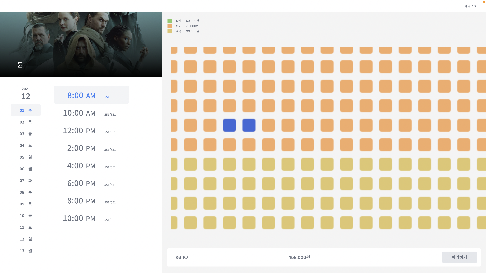
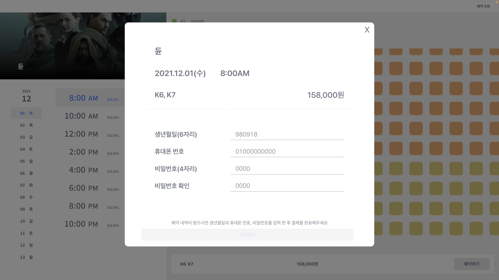
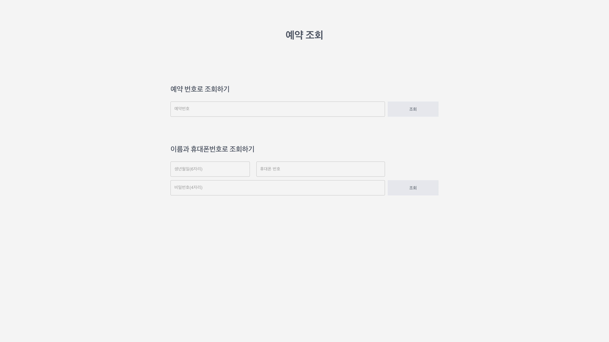
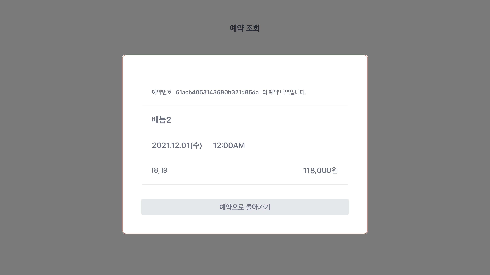

# CS492

실시간 좌석 예약 시스템을 구현한 프로젝트입니다.
사용자는 영화, 날짜, 시간, 좌석을 선택한 후 간단한 개인정보 입력으로 예약을 생성할 수 있고, 예약 완료 시 발급되는 예약 번호 또는 예약 시 입력했던 개인정보로 예약을 조회할 수 있습니다.
한 사용자가 특정 좌석을 선택한 후 예약 확인 단계로 넘어가면 그 좌석은 선점 상태가 되어 선택이 비활성화되고, 선점 후 5분이 지난 시점에 예약이 완료되지 않으면 좌석은 선점이 최소되어 예약 가능 상태가 됩니다.

## Table of Content

- [다운로드 및 실행](#다운로드-및-실행)

- [선점 로직 확인](#선점-로직-확인)

- [Client](#client)

  - [클라이언트 기술 스택](#클라이언트-기술-스택)
  - [클라이언트 구성](#클라이언트-구성)

- [Server](#server)

  - [서버 기술 스택](#서버-기술-스택)
  - [데이터베이스](#데이터베이스)
  - [서버 실행](#서버-실행)
  - [서버 구성](#서버-구성)

- [Browser Support](#browser-support)

## 다운로드 및 실행

1. clone the repository

```bash
 git clone https://github.com/kaikim97/CS492.git
```

2. npm 패키지 설치

```bash
 npm install
```

3. 리액트 실행

```bash
 npm start
```

3. 서버 실행

```bash
 cd server
 node server
```

## 선점 로직 확인

      port 2개 필요 ex) 3000, 3001
      port 3000에서 좌석 선택 후 예약하기 버튼 누르면 port 3001에서 해당 좌석 선택 비활성화
      5분 경과 후 port 3000에서 예약이 완료되지 않으면 port 3001에서 해당 좌석 선택 활성화


## Client

### 클라이언트 기술 스택

- 뷰 레이어 : React
- 라우팅 : React router
- 스타일 요소 : tailwindcss
- 상태 관리 : Context API

### 클라이언트 구성

```bash
src
├── data
│   ├── movies
│   └── seats-kaist.json
├── features
│   ├── Topbar.js
│   ├── movieTable
│   │   ├── MovieRating.js
│   │   └── MovieTable.js
│   ├── dateTimeSeatTable
│   │   ├── components
│   │   │   ├── DateTable.js
│   │   │   ├── TimeTable.js
│   │   │   └── Seat.js
│   │   └── DateTimeSeatTable.js
│   ├── PersonalInfo.js
│   └── FindReservation.js
├── library
│   ├── CustomButton.js
│   ├── Ticket.js
├── api.js
├── context.js
└── apolloSetup.js
```

📁 data : 이미지 또는 dummy data, json 파일을 저장하는 디렉토리

      📁 movies : 영화 포스터 이미지 저장

      📓 seats-kaist.json : 좌석 배치도 json 파일

📁 features : 기능별 React component

      📓 Topbar.js : "예약 조회" 버튼이 있는 상단바 컴포넌트

      📁 movieTable : 영화 선택 화면에 관한 디렉토리

            📓 MovieRating.js : 영화의 평점을 별로 나타내기 위한 컴포넌트 5개에 대한 비율로 나타남.

            📓 MovieTable.js : 영화 선택 화면 컴포넌트

      📁 dateTimeSeatTable : 영화 선택 후 날짜, 시간, 좌석 선택 화면에 관한 디렉토리

            📁 components : DateTimeSeatTable.js 에 렌더되는 부속 컴포넌트 디렉토리

                  📓 DateTable.js : 날짜 선택을 위한 컴포넌트

                  📓 TimeTable.js : 시간 선택을 위한 컴포넌트

                  📓 Seat.js : 좌석 선택을 위한 컴포넌트

            📓 DateTimeSeatTable.js : 날짜, 시간, 좌석 선택 화면 컴포넌트

      📓 PersonalInfo.js : 영화, 날짜, 시간, 좌석 선택 후 예약을 위해 사용자의 개인정보를 입력받는 컴포넌트

      📓 FindReservation.js : 상단바의 "예약조회" 버튼을 누르면 나오는 화면에 관한 컴포넌트
                              생년월일 / 휴대폰 번호 / 비밀번호 로 조회한 경우 해당하는 모든 예약 내역을 보여줌.

📁 library : 반복되어 사용되는 기능의 라이브러리화

      📓 CustomButton.js : 버튼 컴포넌트. width, name, disabled, onclick 를 props로 받는다. "예약조회" 를 제외한 모든 버튼에 이용됨.

      📓 Ticket.js : 예약 내역을 일정한 형태로 보여주는 컴포넌트. title, date, time, seats, price 을 props로 받는다. 예약 확인 및 개인정보 입력 화면, 예약 조회 화면에서 이용됨.

#### MovieTable.js


#### DateTimeSeat.js



#### PersonalInfo.js



#### FindReservation.js




## Server

실시간 좌석 예약 시스템을 지원하는 서버입니다.

해당 서버는 Javascript 기반의 node.js express framework를 이용하여 작성되었습니다.

### 서버 기술 스택

- node.js
- framework: express

### 데이터베이스

본 서버에서는 클라우드 데이터베이스인 MongoDB Atlas를 사용하였고, mongoose 라이브러리를 이용하여 서버와 DB를 연결했습니다.

#### 데이터베이스 스키마

##### hall (공연장)

```bash
const hallSchema = new mongoose.Schema({
    title: {type: String, required: true},
    date: {type: String, required: true},
    time: {type: String, required: true},
    available: {type: Number, required: true }, // Number of available seats
    occupied: {     // Map of preoccupied or reserved seats
        type: Map,      // Key: seatID
        of: {type: Boolean},     // Value: true(reserved), false(preoccupied)
        default: {},
        required: false
     }
}
```

##### reservation (예약내역)

```bash
const reservationSchema = new mongoose.Schema({
  birth: { type: String, required: false, default: "" },
  phone: { type: String, required: false, default: "" },
  password: {type: String, required: false, default: "" },
  title: { type: String, required: true },
  date: { type: String, required: true },
  time: { type: String, required: true },
  seats: { type: [String], required: true },
  price: { type: Number, required: false }
}
```

### 서버 실행

서버 실행은 server.js 파일이 위치한 폴더에서 이루어져야 합니다.

```bash
$ node server
```

### 서버 구성

```bash
├── models
│   ├── hall.js
│   └── reservation.js
├── routes
│   ├── halls.js
│   ├── reservations.js
│   └── movies.js
├── server.js
└── createData.js
```

📁 models : 오브젝트 스키마 및 필요한 함수 생성

      📓 hall.js : 특정 공연, 날짜, 시간에 해당하는 공연장의 정보를 나타내는 스키마

      📓 reservation.js : 예약 내역 정보를 나타내는 스키마

📁 routes : router 이용하여 서버 API상의 데이터 송/수신

      📓 halls.js : 공연장 정보 조회를 위한 API

            GET /halls : 전체 공연 list 조회
            GET /halls/hall?title=:title&date=:date&time:time : 특정 공연 조회 (title, date, time query로 입력)
            GET /halls/available?title=:title&date=:date : 해당 제목, 날짜의 모든 공연의 (시간, 잔여좌석) 정보 조회 (title, date query로 입력)
            POST /halls : 새로운 공연 정보 DB에 등록 (title, date, time, available body로 입력)
            DELETE /halls/hall?title=:title&date=:date&time:time : 특정 공연 DB에서 삭제 (title, date, time query로 입력)
            POST /preoccupy : 공연장 및 좌석을 body로 받아 선점, 선점 후 개인정보 미등록시 5분뒤 삭제
            PUT /clear : body로 공연장 정보 받아 해당 공연장의 예약/선점정보 모두 삭제

      📓 reservation.js : 예약 내역 생성, 조회를 위한 API

            GET /reservations : 전체 예약 내역 조회
            GET /reservations/search?birth=:birth&phone=:phone&password=:password : 개인정보 및 비밀번호로 예약내역 조회 (query로 개인정보 및 비밀번호 입력)
            GET /reservations/:reservationId : 예약번호로 예약내역 조회 (예약번호 param으로 입력)
            POST /reservations : 새로운 예약 생성 및 생성된 예약 내역 반환 (개인정보 및 비밀번호 body로 전송)
            DELETE /reservations/:reservationId : 예약번호로 예약내역 삭제

      📓 movies.js : 영화 정보 표시를 위한 네이버 오픈 API 연동

📓 server.js : 서버 주소 설정, DB연결 등을 담당하는 서버 실행을 위한 가장 기본 Javascript 파일

📓 createData.js : DB에 초기 공연장 정보 저장을 위한 Javascript 파일, 서버 실행과는 별개로 작동

## Browser Support

<br>

#### Chrome

<br>


